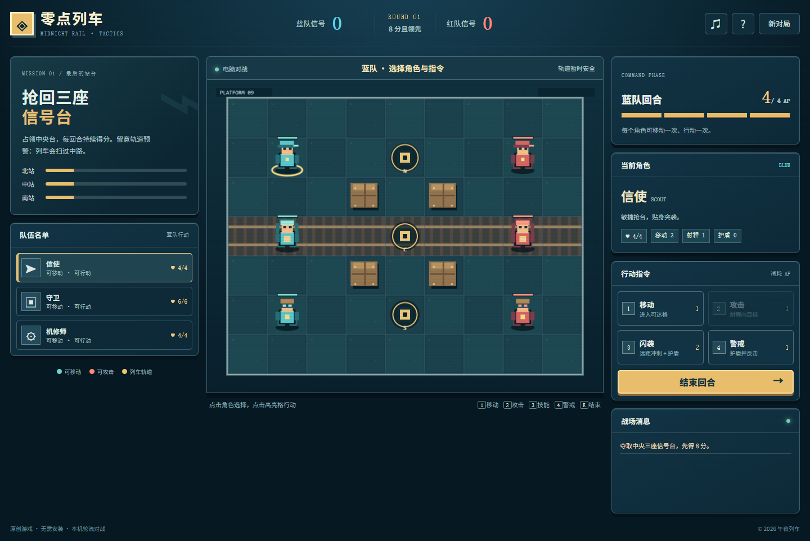

# 零点列车：信号争夺

原创 16 位风格浏览器回合制战棋。三名职业角色、四点行动力、三座会持续计分的信号台，以及每三回合驶过中央轨道的列车。支持单人挑战电脑和**同屏双人轮流操作**；无需账号、广告或外部资源。



## 立即游玩

打开 [在线试玩](https://huoshantao7-hub.github.io/midnight-rail-tactics/)；或下载源码，在项目目录运行 `npm run serve`，再访问 `http://127.0.0.1:8789/`。需要 Node.js 18+。静态文件也可部署到任意静态网站。

## 操作

- 点击己方角色，再点高亮格执行行动；也可直接点击合法目标。手机支持触控。
- 键盘 `1` 移动，`2` 攻击，`3` 职业技，`4` 警戒，`E` 结束回合，`Esc` 取消选择。
- 每回合 4 AP。每名角色最多移动一次、行动一次；移动/攻击/警戒耗 1 AP，职业技耗 2 AP。
- 信使擅长冲刺抢台；守卫能为队友撑起盾墙；机修师能远程直线攻击、修复队友或遥控信号台。
- 拿到至少 8 分且在双方回合结算后领先，或击倒全部对手，即可获胜。同分会继续对战。

## 机制与公平性

障碍阻挡路径与机修师射线；信号台被占领后持续归属当前队，直到对手夺回。每方结束回合时按控制台数量得分。中央轨道每第三回合末造成 2 点伤害，上一回合会提前预警。护盾先吸收伤害，警戒还能对近身攻击反击。电脑通过与玩家同一套规则选择行动，没有额外属性或作弊回合。

“同屏双人”是同一设备轮流操作，并非在线联机。游戏全部美术由项目代码绘制，没有使用其他游戏的角色、商标、音乐或素材。

## 开发与测试

```bash
npm run serve
npm test
```

纯 HTML/CSS/JavaScript Canvas，游戏逻辑在 `engine.mjs`，界面与绘制在 `main.mjs`。测试覆盖移动/占台、回合与列车、护盾反击、遮挡、职业技、同分结算和 AI 完整对局。设计细节见 [GAME_DESIGN.md](GAME_DESIGN.md)，复现说明见 [PROMPT.md](PROMPT.md)。

MIT License。
